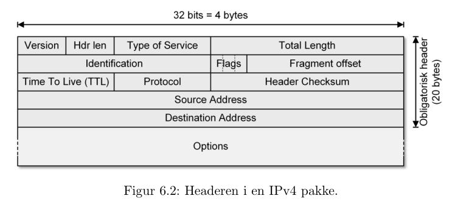
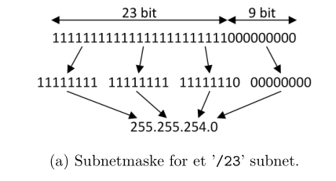
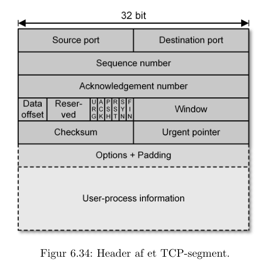

# Internettet: Generelle pricipper og protokoller

**Internettet:** En masse *autonome* subnet

### IPv4 

#### IPv4 Adresser

Adresse-størrlse: 32bit $2^{32} ~ 4\text{ milliarder}$

**Dotted decimal:** 32 bit adressen bliver opdelt i 4 bytes, som repræsenteres i decimal-form.

**Netværks- og host-dele:**

De første $n$ bytes refererer til subnettet af enheden, og de sidste refererer til selve enheden.

### IPv6

**Forskelle:**
- meget større adresser (128bit)
- mindre header 
- ingen checksum
- fragmentering hos afsender

## TCP

* Forbindelses-orienteret protokol (eksplicit setup)
* Over (inden-i) IP

## UDP

* Forbindelses-løs transport protokol.
* Minder om TCP, men med valgfri checksum, og ingen setup

## Applikationsprotokoller

F.eks:

* HTTP
* FTP
* SSH
* SMTP
