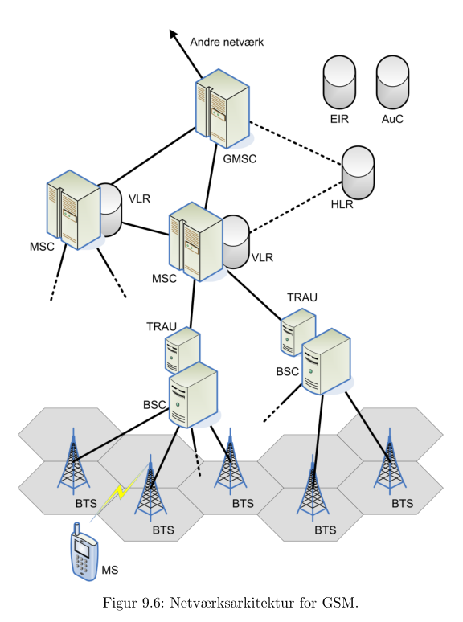

# Mobilnet: Netværkselementer og procedurer 

## Punkter
* Procedurer: Attachment, Location Updating, Handover
* Opsætning af kald fra PSTN aboonent til GSM abbonent

## GSM Netværksarkitektur

### Enheder:

* **MS:** Mobile Station
	- Din mobiltelefon.
* **BTS:** Base Tranciever Station
	- Indeholder radiosender og modtager
	- Ansvarlig for kryptering og dekryptering
* **BSC:** Base Station Controller
	- Kontrollerer BTS'er
	- Holder bl.a. styr på reserverede timeslots, håndtering af handovers, osv.
* **TRAU:** Transcoder and Rate Adaptation Unit
	- Forbundet til BSC
	- Transkoder signal, f.eks. mellem 13kb/s og 64 kb/s
* **MSC:** Mobile Switching Center
	- Forbinder samtaler mellem mobile brugere og andre brugere (både mobil og fastnet)
	- Én MSC styrer et antal BSC'er
	- MSC beder f.eks. en BSC om at reservere et timeslot
* **GMSC:** Gateway Mobile Switching Center
	- En type MSC, som også forbindre til andre netværk (end mobilnetværk).
* **VLR:** Visitor Location Register
	- En database, som er tilknyttet en MSC.
	- Indeholder info om brugere, deres lokation, og hvilke tjenester de har adgang til.
	- Kun info om brugere, som er 'hører til' en given MSC.
* **HLR:** Home Location Register
	- En database, som har info om alle operatørens abbonenter.
	- HLR viser, hvilken VLR har info om brugeren p.t..
	- HLR viser også, om brugerens telefon roamer, eller er slukket.
* **EIR:** Equipment Identification Register
	- Indeholder info om spærrede mobiltelefoner.
	- Står som **IMEI** (*International Mobile Equipment Identifier*) numre.
* **AuC:** Authentication Center
	- Sikkerhedsrelateret info om abonnenter.
	- Sørger for "log-on"-agtigt procedure.

### Andre arkitekturer:
- **GPRS/EDGE**
- **UMTS/HSDPA/HSUPA**
- **LTE**

## Procedurer

### Attachment

### Location Updating

### Handover

## Opsætning af kald fra PSTN til GSM
